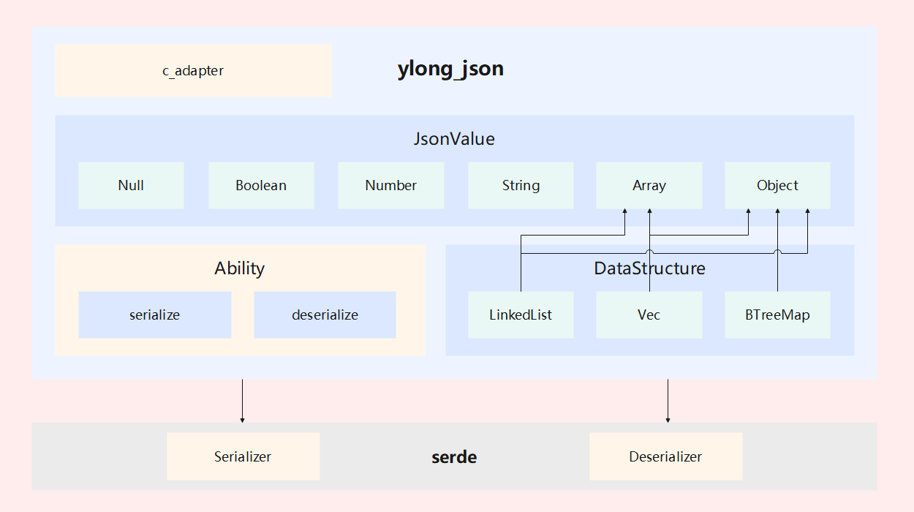

# ylong_json

## Introduction
The `ylong_json` module provides serialization of text or string in JSON syntax format and deserialization of corresponding generated instances.

### ylong_json in Openharmony

Here is the description of the key fields in the figure above:
- `ylong_json` : System component that provides json serialization and deserialization capabilities
- `serde` : Third-party library for efficient and generic serialization and deserialization of Rust data structures.

### ylong_json Internal architecture diagram

`ylong_json` is mainly divided into two modules, a module with a custom `JsonValue` structure type as the core and a module that ADAPTS to the third-party library `serde`.

1. `JsonValue` is the internal custom structure type of `ylong_json`, and the serialization and deserialization function of `json` is built with this structure as the core.
- `JsonValue` : The core structure type, which stores the json content information, has 6 internal enum type variants.
- `LinkedList`, `Vec`, `BTreeMap` : Three ways of storing data inside `Array` and `Object`, selected by `features`.
- Serialization ability: Supports outputting a `JsonValue` instance as a compact strings or writing to the output stream.
- Deserialization ability: Supports parsing `json` text or `json` content in the input stream and generating a `JsonValue` instance.

2. `ylong_json` adapts to the third-party library `serde` 
- `Serializer`: The auxiliary structure for serialization.
- `Deserializer`: The auxiliary structure for deserialization.
- Serialization ability: Supports for serializing a type instance that implements the `serde::Serialize` trait into `json` text content or writing the content to the output stream.
- Deserialization ability: If the `json` content has the type that implements `serde::Deserialize` trait, then that part of the `json` content can be deserialized into an instance of that type.

## Directory
```
ylong_json
├─ examples                               # ylong_json code example
├─ include                                # ylong_json.h
├─ src
│  ├─ value                               # Array and Object type definitions and related methods
│  ├─ adapter.rs                          # Adapts to the C interface implementation
│  ├─ consts.rs                           # Some definitions of constants and tables
│  ├─ deserializer.rs                     # Deserialization implementation of the adaptation serde
│  ├─ encoder.rs                          # Serialization implementation for the `JsonValue` type
│  ├─ error.rs                            # Error type definition, helpful to identify the problem
│  ├─ link_list.rs                        # LinkedList type definition and related methods
│  ├─ serializer_compact.rs               # Serialization implementation of the adaptation serde
│  ├─ states.rs                           # Deserialization implementation for the `JsonValue` type
│  └─ value.rs                            # JsonValue type definition and related methods
└─ tests                                  # Test directory
```

## Build
`GN` is supported. User should add dependencies in `deps` of `BUILD.GN` to build this crate.

```gn 
deps += ["//commonlibrary/rust/ylong_json:lib"]
```

`Cargo` is supported. User should add dependencies in ```Cargo.toml``` to build this crate.

```toml
[dependencies]
ylong_json = { path = "/commonlibrary/rust/ylong_json" } # Uses path dependencies.
```

## User Guide
See [user_guide](./docs/user_guide.md)

## Performance test
```
1.Test environment
OS: Linux
Architecture: x86_64
Byte Order: Little Endian
Model number: Intel(R) Xeon(R) Gold 6278C CPU @ 2.60GHz
CPU(s): 8
MemTotal: 16G

2.Test result
| Serialize | ylong_json      | serde_json     |
------------------------------------------------
| null      | 150 ns/iter     | 175 ns/iter    |
| boolean   | 155 ns/iter     | 178 ns/iter    |
| number    | 309 ns/iter     | 291 ns/iter    |
| string    | 513 ns/iter     | 413 ns/iter    |
| array     | 998 ns/iter     | 1,075 ns/iter  |
| object    | 1,333 ns/iter   | 1,348 ns/iter  |
| example1  | 12,537 ns/iter  | 12,288 ns/iter |
| example2  | 23,754 ns/iter  | 21,936 ns/iter |
| example3  | 103,061 ns/iter | 97,247 ns/iter |
| example4  | 15,234 ns/iter  | 17,895 ns/iter |

| Deserialize | ylong_json      | serde_json     |
--------------------------------------------------
| null        | 257 ns/iter     | 399 ns/iter    |
| boolean     | 260 ns/iter     | 400 ns/iter    |
| number      | 1,507 ns/iter   | 989 ns/iter    |
| string      | 414 ns/iter     | 610 ns/iter    |
| array       | 2,258 ns/iter   | 2,148 ns/iter  |
| object      | 810 ns/iter     | 1,386 ns/iter  |
| example1    | 10,191 ns/iter  | 10,227 ns/iter |
| example2    | 15,753 ns/iter  | 18,022 ns/iter |
| example3    | 55,910 ns/iter  | 59,717 ns/iter |
| example4    | 18,461 ns/iter  | 12,471 ns/iter |
```

